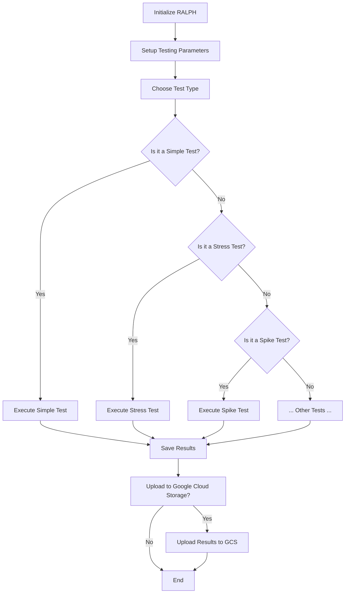

# R.A.L.P.H. - Rapid Automated Load Performance Harness

## Description
RALPH (Rapid Automated Load Performance Harness) is a powerful load testing tool written in Go. Designed to scrutinize the performance of websites using a multitude of load testing strategies, RALPH can efficiently simulate simple tests, stress tests, spike tests, endurance tests, and ramp-up tests. At the conclusion of each test, RALPH promptly saves the results into a CSV format, further offering the capability to upload these results seamlessly to Google Cloud Storage.


## Installation and Build Instructions

### Prerequisites:

1. **Go (Golang)**: RALPH requires Go to run. If you haven't installed it yet, you can download it from [the official Go website](https://golang.org/dl/).

2. **Google Cloud SDK**: To exploit the Google Cloud Storage upload functionality, ensure the Google Cloud SDK is installed. Download it from [the official Google Cloud SDK website](https://cloud.google.com/sdk/docs/install).

3. **Environment Variable Setup**: If you're leveraging the Google Cloud Storage feature, it's essential to have the `GOOGLE_APPLICATION_CREDENTIALS` environment variable pointing to your service account key's path. [Here's a guide to assist you in setting it up](https://cloud.google.com/docs/authentication/getting-started).

### Installation:

1. **Get the Source**:

   ```bash
   git clone https://github.com/Chaos-Camp/RAPLH.git
   cd RAPLH
   ```

2. **Manage Dependencies**:

   Ensure you've grabbed all the essential dependencies:

   ```bash
   go mod tidy
   ```

### Build:

1. **Craft the Executable**:

   Compile the code to produce an executable named `loadtester` (or `loadtester.exe` for Windows users):

   ```bash
   go build -o loadtester main.go
   ```

### Running:

Execute the built tool:

```bash
./loadtester -url=https://www.test-site.com -type=simple -iterations=3
```

(Note: Windows users should refer to the executable as `loadtester.exe`)

## Usage

Ensure the environment variable for GCS authentication is correctly set:

```bash
export GOOGLE_APPLICATION_CREDENTIALS=<path_to_service_account_json>
```

### Options:

- **URLs & Tests**:
    - `-url`: Specifies the URL for testing. Default: "https://www.example.com".
    - `-type`: Indicates the type of load test. Options include "simple," "stress," "spike," "endurance," and "ramp_up". Default: "ramp_up".

- **Parameters**:
    - `-iterations`: Sets the iteration count for simple tests. Default: 1.
    - `-concurrentRequests`: Sets the concurrency level for stress tests. Default: 5.
    - `-spikes`: Designates the spike count for spike tests. Default: 3.
    - `-spikeInterval`: Determines the time (in seconds) between spikes. Default: 1.0s.
    - `-duration`: Specifies the total runtime (in seconds) for endurance tests. Default: 300s (5 minutes).
    - `-maxUsers`: Sets the user cap for ramp-up tests. Default: 10.
    - `-rampUpPeriod`: Determines the ramp-up duration (in seconds). Default: 10s.

- **Storage**:
    - `-bucket`: Identifies the Google Cloud Storage bucket for result uploads. Default: "my-bucket".

### Examples:

The following are use-case scenarios showcasing how to utilize RALPH for various testing methodologies:

1. **Simple Test**:
   ```bash
   go run main.go -url=https://www.test-site.com -type=simple -iterations=3
   ```

2. **Stress Test**:
   ```bash
   go run main.go -url=https://www.stress-site.com -type=stress -concurrentRequests=10
   ```

3. **Spike Test**:
   ```bash
   go run main.go -url=https://www.spike-site.com -type=spike -spikes=5 -spikeInterval=2
   ```

4. **Endurance Test**:
   ```bash
   go run main.go -url=https://www.endurance-site.com -type=endurance -duration=600
   ```

5. **Ramp Up Test**:
   ```bash
   go run main.go -url=https://www.rampup-site.com -type=ramp_up -maxUsers=15 -rampUpPeriod=15
   ```

6. **Storing Results**:
   ```bash
   go run main.go -url=https://www.example-site.com -type=spike -bucket=my-special-bucket
   ```

Post the test's completion, results will be stowed away in a CSV file named following the URL's sanitized format, ending with `_results.csv`. This file will subsequently be uploaded to the Google Cloud Storage bucket designated earlier.

## Contributing

For those interested in contributing, please adhere strictly to Go's coding conventions and recognized best practices when submitting your pull requests.

## License

RALPH is proudly open-sourced, welcoming everyone to access and use it. If you choose to incorporate or refer to this code elsewhere, we humbly ask for appropriate attribution.

